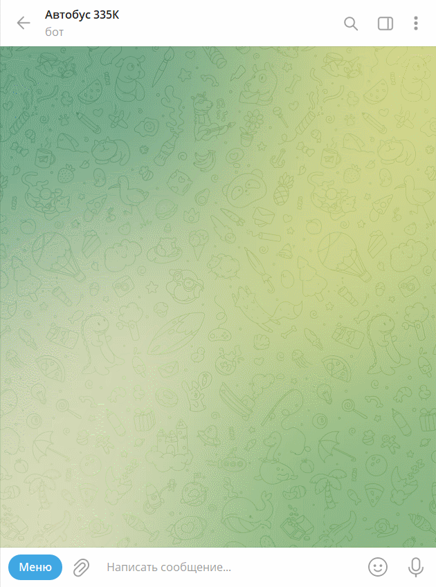

# bus335K-telebot
This application is designed to launch a telegram bot that can determine the time of the nearest bus from Fryazino to Moscow and vice versa.

Main libraries used in this project: pyTelegramBotAPI, pytz.

Before run:
1) Install libraries from requirements.txt
2) create settings.py and put your bot token in TG_TOKEN, for example: TG_TOKEN='123456:qwertyuiop'

